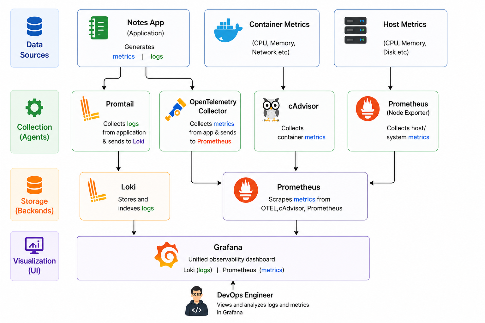
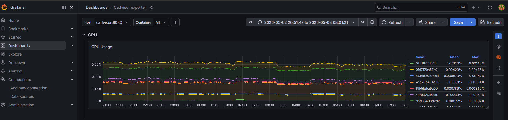
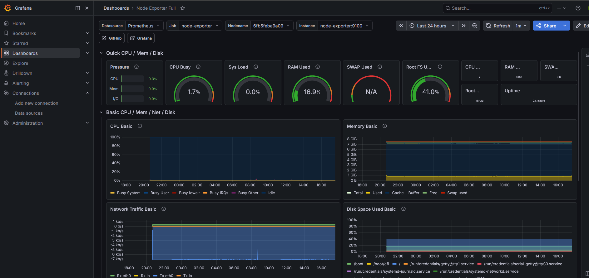
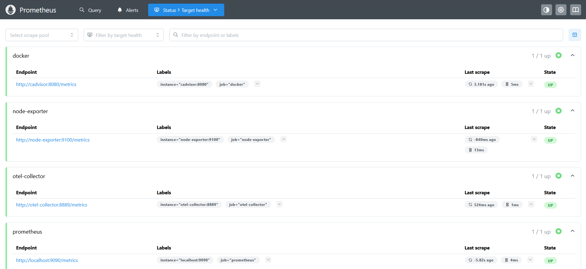
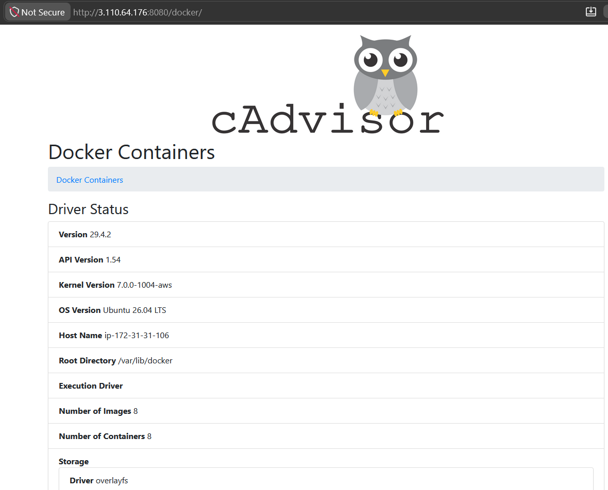
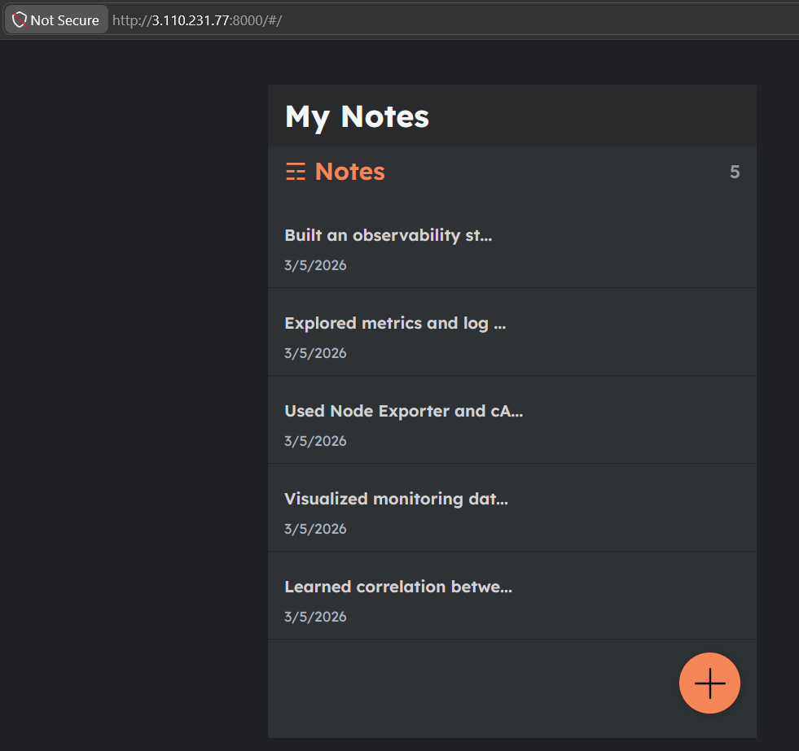

# 🚀 MonitoringForDevOps – Observability Stack

A production-inspired **observability stack** designed to monitor applications and infrastructure using industry-standard tools.

This project demonstrates how to collect, store, and visualize **metrics and logs** in a fully containerized environment using modern DevOps practices.

---

---

## 🧰 Tech Stack

| Category       | Tool           | Purpose                                        |
| -------------- | -------------- | ---------------------------------------------- |
| Metrics        | Prometheus     | Time-series metrics collection & storage       |
| Logs           | Loki           | Log aggregation and indexing                   |
| Log Collection | Promtail       | Ships logs from containers to Loki             |
| Containers     | cAdvisor       | Container-level metrics (CPU, memory, network) |
| Host Metrics   | Node Exporter  | System-level metrics (CPU, RAM, disk)          |
| Visualization  | Grafana        | Unified dashboards for logs & metrics          |
| Orchestration  | Docker Compose | App orchestration                          |

---

## 🔍 Project Flow

---

## ⚙️ What This Project Does

- 📊 Collects **application and container logs**
- 📈 Scrapes **system and container metrics**
- 🗂️ Stores logs in **Loki** and metrics in **Prometheus**
- 📉 Visualizes data using **Grafana dashboards**
- 🔎 Provides a **single-pane observability view**

---

## 🏗️ Architecture Overview

This project follows a modular and scalable observability design:

### 1️⃣ Metrics Flow (Performance Data)

- **Infrastructure Monitoring**
  - cAdvisor & Node Exporter collect system and container metrics  
  - Prometheus scrapes these metrics at regular intervals  

- **Application Monitoring**
  - Application metrics are sent via **OpenTelemetry Collector**  
  - Prometheus pulls these metrics for storage and querying  

---

### 2️⃣ Logs Flow (Event Data)

- **Log Generation**
  - Applications generate logs (stdout/stderr via Docker)

- **Log Shipping**
  - Promtail collects and labels logs  
  - Ships them to Loki for indexing and storage  

---

### 3️⃣ Visualization Layer

- Grafana integrates with **Prometheus + Loki**
- Enables correlation between:
  - 📈 Metrics (CPU spikes, memory usage)
  - 📜 Logs (errors, failures)

👉 This helps in faster debugging and root cause analysis

---

## 📊 Project Snapshots

### 📊 Monitoring Dashboards

| Grafana Dashboard | Node Exporter |
|------------------|--------------|
|  |  |

| Prometheus | cAdvisor |
|-----------|----------|
|  |  |

| Notes-app UI |
|-----------|
|  |

---

## 🚀 Key Capabilities

- 📈 Real-time system & container monitoring  
- 📜 Centralized log aggregation  
- 🔍 Queryable logs and metrics  
- 📉 Performance bottleneck detection  
- 🧩 Modular and extensible architecture  

---

## 🚀 Future Improvements

### 🔔 Alerting & Incident Response
- Integrate alerting (Slack / Email / Webhooks)  
- Define thresholds for CPU, memory, and downtime  
- Simulate real-world incidents and response workflows  

---

### 📊 Advanced Observability (Logs + Tracing)
- Enhance log aggregation capabilities  
- Integrate distributed tracing (OpenTelemetry + Jaeger)  
- Correlate **metrics, logs, and traces**  

---

### ☸️ Kubernetes Monitoring
- Extend monitoring to Kubernetes environments  
- Track pod health, restarts, and resource usage  
- Integrate kube-state-metrics for cluster insights  

---
